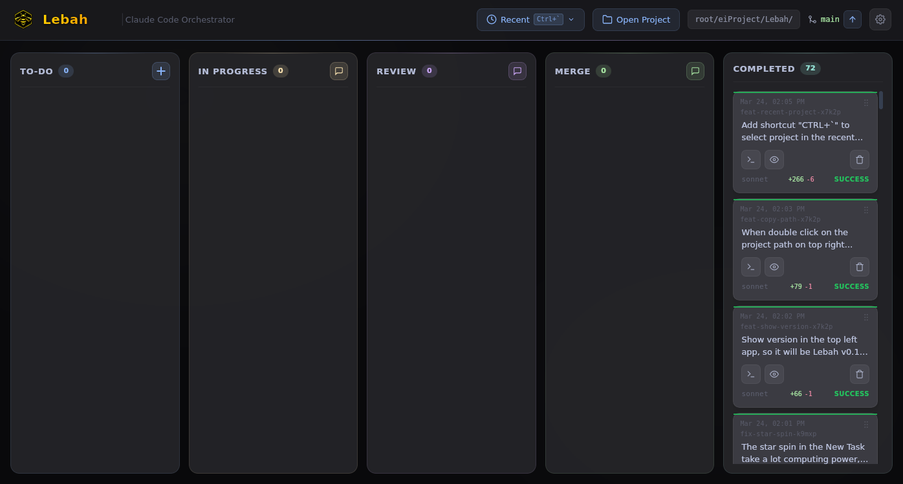
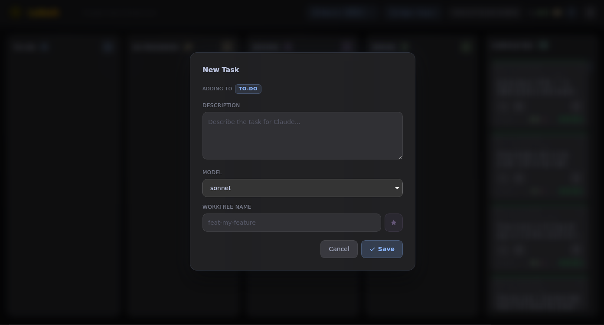
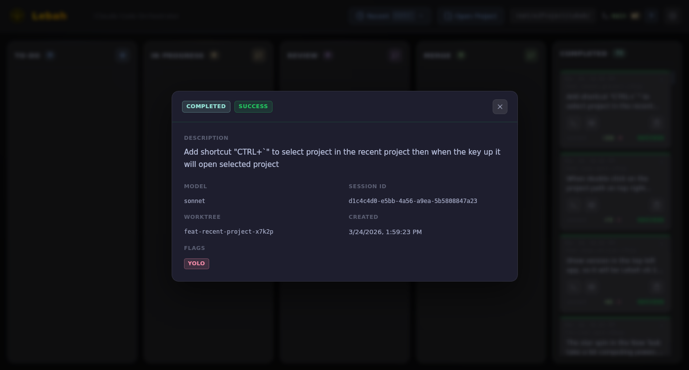
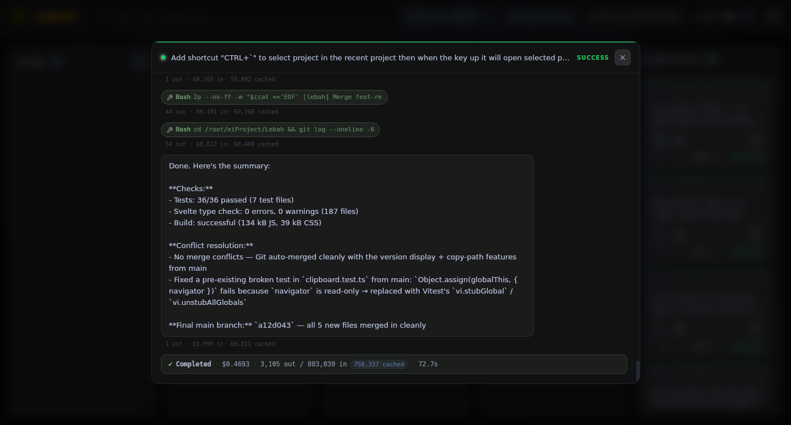
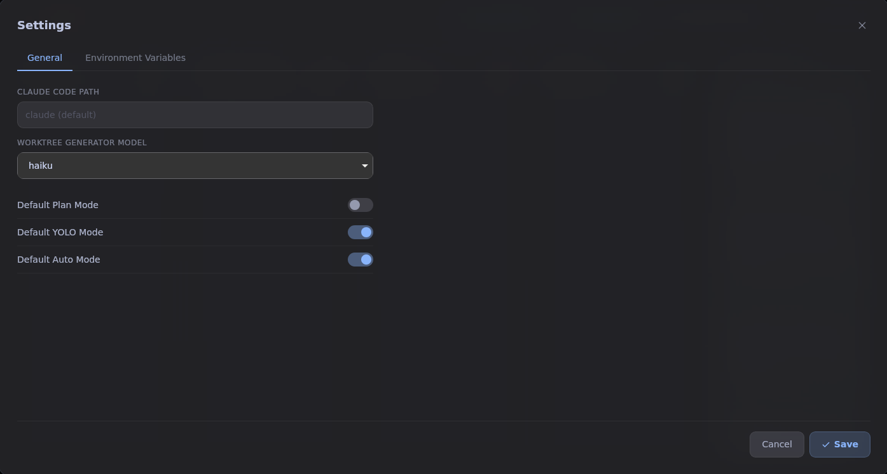
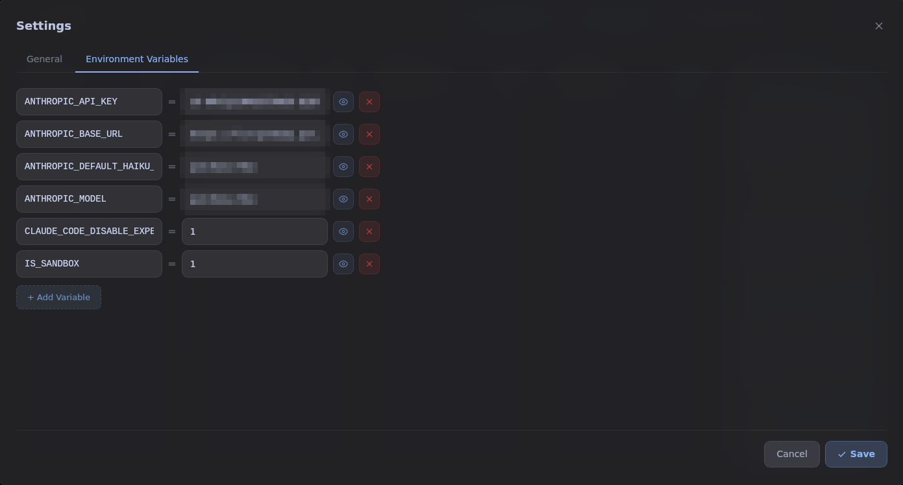

# Lebah

> A kanban board desktop app for orchestrating multiple Claude Code CLI sessions.

Manage AI coding sessions visually — create tasks, drag them through workflow stages, and run Claude Code with live terminal output, all from a single desktop window.

---

## Features

- **Kanban workflow** — Five columns: To-Do → In Progress → Review → Merge → Completed
- **Drag & drop** — Reorder and move tasks between columns
- **Live terminal** — Fullscreen terminal modal with real-time stdout/stderr and stdin support
- **Tool use visualization** — Terminal parses and highlights Claude tool calls (Read, Write, Edit, Bash, etc.)
- **Session control** — Start and stop Claude Code sessions per task
- **Auto-advance** — Automatically progress tasks through columns on success, with column-specific prompt templates
- **Merge queue** — Serializes multiple merge tasks so only one runs at a time
- **Plan mode** — Run Claude in `--permission-mode plan` (read-only proposals)
- **Yolo mode** — Run with `--dangerously-skip-permissions` for unattended automation
- **Model selection** — Override the Claude model per task
- **Git status** — See current branch, ahead/behind counts, and changed file count (auto-refreshes every 30s)
- **Custom Claude path** — Override the Claude CLI binary per task
- **Project templates** — Configure per-project prompt templates for each workflow stage
- **Environment variables** — Configure per-project environment variables passed to Claude sessions (with enable/disable toggle)
- **Settings modal** — Centralized settings with General and Environment Variables tabs
- **Worktree name display** — Tasks show their associated worktree name
- **Auto-generated worktree names** — AI-powered worktree name generation when creating tasks
- **Persistent state** — All tasks and settings saved in a local SQLite database

## Screenshots

<table>
  <tr>
    <td></td>
    <td></td>
    <td></td>
  </tr>
  <tr>
    <td></td>
    <td></td>
    <td></td>
  </tr>
</table>

## Requirements

- [Rust](https://rustup.rs/) (stable toolchain)
- [Node.js](https://nodejs.org/) v18+
- [Claude Code CLI](https://docs.anthropic.com/en/docs/claude-code) installed and on `PATH`
- Linux / macOS / Windows with [Tauri v2 prerequisites](https://v2.tauri.app/start/prerequisites/)

## Getting Started

```bash
# 1. Clone the repo
git clone https://github.com/your-username/LebahTempa.git
cd LebahTempa

# 2. Install all dependencies
make setup

# 3. Start the development app
make dev
```

## Build

```bash
make build        # production build (outputs to src-tauri/target/release/)
make run          # run the production build
make test         # run Rust tests, Svelte type check, and Cargo check
make clean        # remove all build artifacts and dependencies
make clean-soft   # clear only caches (Vite, Cargo incremental) for faster rebuilds
```

## Usage

1. **Set your project** — Click the folder icon to select the directory Claude should work in.
2. **Create a task** — Click **+ New Task**, describe what you want Claude to do, and optionally set a custom Claude path, extra CLI flags, or a model override.
3. **Run a session** — Press the play button on a task card. Claude Code starts with the task's UUID as `--session-id`.
4. **Watch the terminal** — Click the terminal icon to open the live output modal. Type to send stdin.
5. **Move tasks** — Drag cards across columns as work progresses, or enable Auto mode to let status changes advance tasks automatically.

### Task Options

| Option | Description |
|---|---|
| **Plan mode** | Passes `--permission-mode plan`; Claude proposes changes without writing files |
| **Yolo mode** | Passes `--dangerously-skip-permissions`; skips all permission prompts |
| **Auto mode** | Automatically advances the task through columns on session success |
| **Claude path** | Override which `claude` binary to use for this task |
| **Model override** | Override the Claude model for this task |
| **Claude command** | Append extra CLI arguments (e.g. `--model claude-opus-4-6`) |
| **Model** | Override the Claude model for this task |

### Status Colors

| Color | Meaning |
|---|---|
| Yellow border | Session is running |
| Green border | Session completed successfully |
| Red border | Session exited with error |
| Orange border | Session exited with warning |
| Blue border | Task is queued in the merge queue (Waiting) |

### Auto-Advance & Templates

When **Auto** mode is enabled on a task, successful session completion triggers automatic column progression:

- **In Progress → Review** — sends the `inprogress_template` as input to start a review session
- **Review → Merge** — sends the `review_template`; queues as Waiting if another merge is already running
- **Merge → Completed** — sends the `merge_template`; starts the next queued merge task

Templates are configurable per project via the project settings panel.

### Environment Variables

Environment variables can be configured per project in the Settings modal:

- Add, edit, or remove environment variables
- Toggle variables on/off using the eye icon (disabled variables are preserved but not passed to sessions)
- Variables are sorted alphabetically by key name
- Default includes `IS_SANDBOX=0`

## Tech Stack

| Layer | Technology |
|---|---|
| Desktop runtime | [Tauri v2](https://v2.tauri.app/) |
| Backend language | Rust |
| Database | SQLite via [rusqlite](https://github.com/rusqlite/rusqlite) |
| Frontend framework | [Svelte 5](https://svelte.dev/) + TypeScript |
| Styling | [Tailwind CSS v4](https://tailwindcss.com/) |
| Drag & drop | [svelte-dnd-action](https://github.com/babakfp/svelte-dnd-action) |

## Settings

The app includes a comprehensive settings modal accessible via the gear icon in the header:

### General Tab
- **Claude Code Path** — Override the default `claude` binary path
- **Worktree Generator Model** — Choose which Claude model (haiku/sonnet/opus) to use for generating worktree names
- **Default Plan Mode** — Enable plan mode by default for new tasks
- **Default Yolo Mode** — Enable yolo mode by default for new tasks
- **Default Auto Mode** — Enable auto-advance by default for new tasks

### Environment Variables Tab
- Configure per-project environment variables passed to Claude sessions
- Each variable has a key, value, and enabled state
- Disabled variables are preserved but not passed to sessions

## Project Structure

```
src/                        # Svelte frontend
├── App.svelte              # Root component, project selector, git status
└── lib/
    ├── components/         # UI components
    │   ├── Board.svelte
    │   ├── Column.svelte
    │   ├── TaskCard.svelte
    │   ├── TaskModal.svelte
    │   ├── TaskDetailModal.svelte
    │   ├── TerminalModal.svelte
    │   ├── TerminalChat.svelte
    │   ├── ConfirmDialog.svelte
    │   └── TaskToggles.svelte
    ├── stores/             # Reactive state
    │   ├── tasks.ts        # Task CRUD, session management, auto-advance
    │   ├── project.ts      # Project path, git status
    │   ├── config.ts       # Project configuration (templates)
    │   └── errors.ts       # Global error state
    ├── actions/            # Svelte actions (portal)
    └── types.ts            # Shared TypeScript types

src-tauri/src/              # Rust backend (Domain-Driven Design)
├── domain/                 # Business entities & repository interfaces
├── application/            # Use cases, services, event bus
├── infrastructure/         # Claude runner, persistence, session manager
└── presentation/           # Tauri IPC command handlers & DTOs
```

## Contributing

Contributions are welcome. Please open an issue before submitting a pull request for significant changes.

1. Fork the repository
2. Create a feature branch (`git checkout -b feat/your-feature`)
3. Commit your changes
4. Open a pull request

## License

MIT
